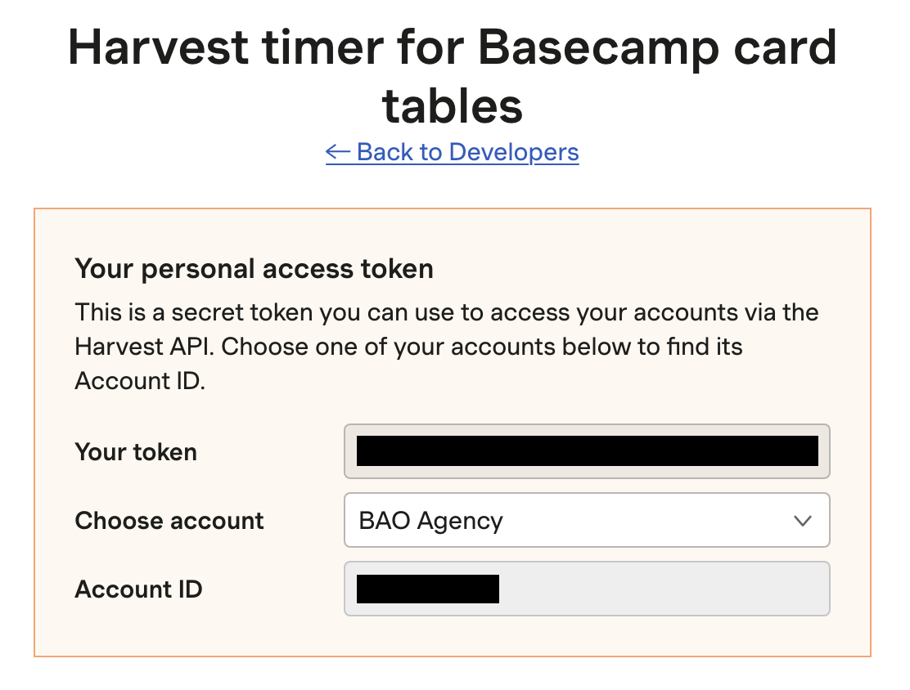

# Harvest Extension

Injects a Harvest timer button into the Basecamp toolbar of card table cards (Kanban layout tasks)

https://www.getharvest.com/add-time-tracking

## Credentials

This Chrome extension utilises [Harvest's API V2](https://help.getharvest.com/api-v2/). Follow the steps below to add the required credentials before installing the extension.

- Create a file named `content-scripts/config.js` based on the existing `content-scripts/config.example.js` file.
- Create a [Personal access token](https://id.getharvest.com/oauth2/access_tokens/new) called "Harvest Timer for Basecamp Card Tables"
- Set the value of `account_id` in `content-scripts/credentials.js` to the value labelled "Account ID"
- Set the value of `token` in `content-scripts/credentials.js` to the value labelled "Your token"

## Installation

- Navigate to the [extensions page](chrome://extensions/) `(chrome://extensions/)` in Google Chrome
- Turn on "Developer mode". (Toggle in top right corner)
- Click on "Load Unpacked" and select the folder on your machine containing the extension's code

