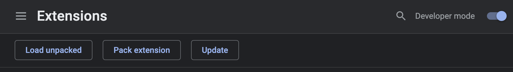

# BAO - Harvest Extension

- Automatically populates the Harvest description with the name of the task being worked on.
- Links time entries to URLs
- Remembers selected project per merchant once selected
- Configurable for any project management platform


## Installation

- Navigate to the [extensions page](chrome://extensions/) `(chrome://extensions/)` in Google Chrome
- Turn on "Developer mode". (Toggle in top right corner)
- Click on "Load Unpacked" and select the folder on your machine containing the extension's code



## Configuration

Duplicate the `content-scripts/config.example.js` file and name it `content-scripts/config.js`. 

The configuration can be updated to include valid CSS selectors referencing elements on the page.

`task_title` should contain a selector for an element which contains the task's title. If a selector isn't provided the text content the `<title>` element will be used.
The included example for "basecamp.com" has `.todo__title` and `.message__subject` as selectors for `task_title` because "Todos" and "Card Tables" use different selectors for the their respective titles.

`group_name` should contain a selector for an element which contains a unique identifier for the project/merchant. An example of this would be the name of the merchant. This ensures the extension will automatically preselect the previously selected merchant for future time entries once the first time entry has been tracked against a merchant. The HTML element will first be checked for an attribute of `content` and use this value. If that value doesn't exist the element will be checked for `textContent`.

Example:
```
window.BAO = window.BAO || {}

window.BAO.HarvestExtension = {
  mode: 'production',
  platforms: [
    {
      hostname: 'basecamp.com',
      selectors: {
        task_title: [
          '.todo__title',
          '.message__subject'
        ],
        group_name: [
          'meta[name="current-bucket-name"]'
        ]
      }
    },
    {
      hostname: 'monday.com',
      selectors: {
        task_title: [
          '.heading-component',
        ],
        group_name: [
          '.workspace-name-wrapper'
        ]
      }
    },
    {
      hostname: 'asana.com',
      selectors: {
        task_title: [
          '.TitleInput-objectName',
        ],
        group_name: [
          'meta[name="shard_id"]'
        ]
      }
    }
  ]
}
```

[Time Tracking in Harvest Company Policy](https://3.basecamp.com/3940865/buckets/6414578/messages/5005793582)
